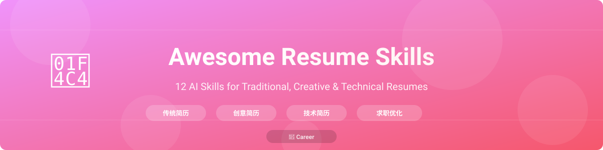

# Awesome Resume Skills

**简历是你的第一印象。** 12个AI技能覆盖传统简历、创意简历、技术简历 — 加上ATS优化和求职信。

[English](README.md) | [中文](README.zh.md)

---

## 为什么需要这个合集？

大多数简历建议都很笼统。这12个AI技能为你提供**可操作的框架、填空式模板和真实前后对比示例** — 涵盖从企业简历到信息图表简历再到技术作品集的每种简历格式。

每个技能包含：
- **适用场景** — 明确的触发条件
- **框架** — 结构化方法和公式
- **模板** — 即用的填空格式
- **示例** — 真实的前后对比
- **常见错误** — 需要避免的坑
- **中文版本** — 每个技能都有中文版本

## 分类

### 🏢 传统简历

成熟、专业的格式，适合企业和机构岗位。

| 技能 | 描述 | 适用场景 |
|------|------|----------|
| [专业简历](skills/传统简历/professional-resume.md) | ATS友好的企业简历 | 金融、咨询、企业岗位 |
| [学术简历](skills/传统简历/academic-cv.md) | 完整的学术CV | 教职、博后、研究岗位 |
| [联邦简历](skills/传统简历/federal-resume.md) | 详细的政府简历 | 美国政府职位 |

### 🎨 创意简历

视觉化和多媒体格式，适合创意专业人士。

| 技能 | 描述 | 适用场景 |
|------|------|----------|
| [信息图表简历](skills/创意简历/infographic-resume.md) | 数据可视化简历 | 设计、UX、市场营销 |
| [作品集简历](skills/创意简历/portfolio-resume.md) | 含项目展示的简历 | 开发者、设计师作品集 |
| [视频简历](skills/创意简历/video-resume.md) | 视频脚本和制作指南 | 媒体、传播、初创公司 |

### 💻 技术简历

针对工程和数据岗位优化的格式。

| 技能 | 描述 | 适用场景 |
|------|------|----------|
| [软件工程师](skills/技术简历/software-engineer.md) | 全级别的SWE简历 | 初级 → Staff工程师 |
| [数据科学家](skills/技术简历/data-scientist.md) | DS/ML工程师简历 | 数据科学、ML、AI岗位 |
| [DevOps工程师](skills/技术简历/devops-engineer.md) | DevOps/SRE简历 | 基础设施、SRE、平台岗 |

### 🎯 求职优化

通过ATS优化、求职信和LinkedIn最大化你的成功率。

| 技能 | 描述 | 适用场景 |
|------|------|----------|
| [ATS优化](skills/求职优化/ats-optimization.md) | 攻克简历筛选系统 | 任何在线申请 |
| [求职信](skills/求职优化/cover-letter.md) | 撰写有力的求职信 | 被要求时或想脱颖而出 |
| [LinkedIn优化](skills/求职优化/linkedin-optimization.md) | 个人资料SEO和网络 | 求职、人脉、个人品牌 |

## 快速开始

1. **确定分类** — 你的目标是传统、创意还是技术岗位？
2. **选择技能** — 选择匹配目标岗位的技能
3. **阅读框架** — 理解结构和原则
4. **使用模板** — 复制并填入你的信息
5. **研究示例** — 对比前后版本来优化内容
6. **检查常见错误** — 避免别人踩过的坑

## 贡献

欢迎贡献！参见 [CONTRIBUTING.md](CONTRIBUTING.md) 了解指南。

## 许可证

本项目基于MIT许可证 - 详见 [LICENSE](LICENSE) 文件。

## 致谢

我们相信每个人都值得拥有一份好简历。
